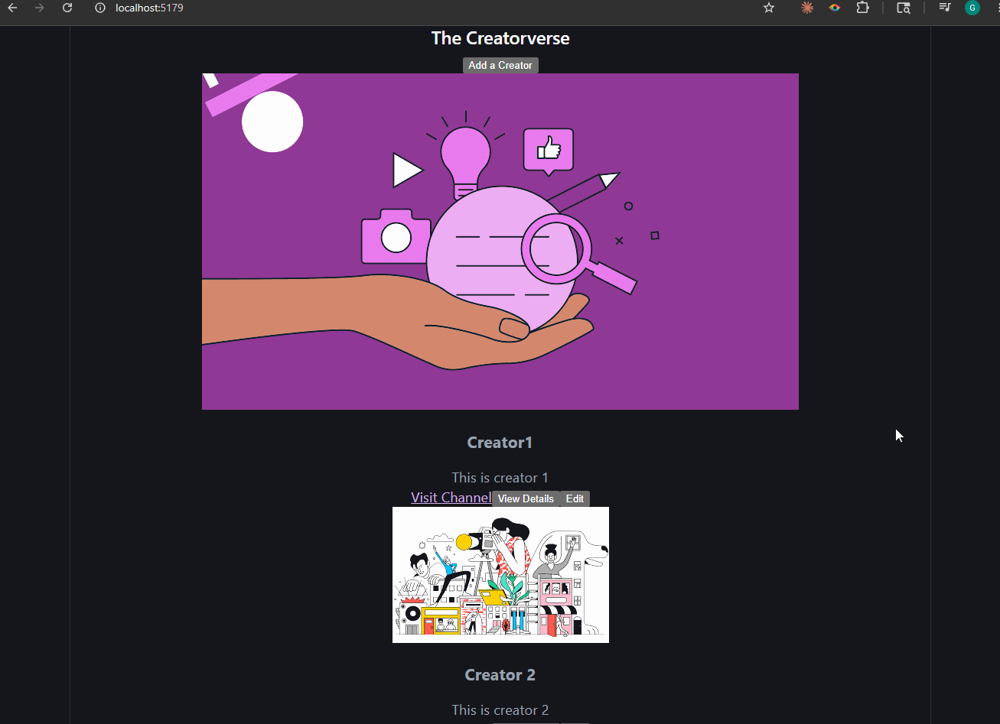

# WEB103 Prework - *Creatorverse*

Submitted by: **Gildardo Orea**

About this web app: **Creatorverse is a customized content creator database. It allows users to track their favorite creators, save their channel links, and manage their information using a React frontend and a Supabase backend.**

Time spent: **20** hours

## Required Features

The following **required** functionality is completed:

<!-- 👉🏿👉🏿👉🏿 Make sure to check off completed functionality below -->
- [x] **A logical component structure in React is used to create the frontend of the app**
- [x] **At least five content creators are displayed on the homepage of the app**
- [x] **Each content creator item includes their name, a link to their channel/page, and a short description of their content**
- [x] **API calls use the async/await design pattern via Axios or fetch()**
- [x] **Clicking on a content creator item takes the user to their details page, which includes their name, url, and description**
- [x] **Each content creator has their own unique URL**
- [x] **The user can edit a content creator to change their name, url, or description**
- [x] **The user can delete a content creator**
- [x] **The user can add a new content creator by entering a name, url, or description and then it is displayed on the homepage**

The following **optional** features are implemented:

- [ ] Picocss is used to style HTML elements
- [ ] The content creator items are displayed in a creative format, like cards instead of a list
- [x] An image of each content creator is shown on their content creator card

The following **additional** features are implemented:

* [ ] List anything else that you added to improve the site's functionality!

## Video Walkthrough

Here's a walkthrough of implemented required features:

👉🏿

<!-- Replace this with whatever GIF tool you used! -->
GIF created with LICEcap 
<!-- Recommended tools:
[Kap](https://getkap.co/) for macOS
[ScreenToGif](https://www.screentogif.com/) for Windows
[peek](https://github.com/phw/peek) for Linux. -->

## Notes

Describe any challenges encountered while building the app or any additional context you'd like to add.
- Connecting to the backend: I struggled a little getting the React app to actually talk to the live Supabase database, as it was my first time using it it took me some trial and error.
  I had to make sure the useEffect pulled the data right when the page loaded, that was a little tricky for me.
- Building the reusable card component: Making the component dynamic enough to handle the different creators was also a little tricky at first. I had to make sure I was passing down the props correctly
  so everything rendered right
- Implementing the edit feature: The edit page was the most challenging one for me to put together. I am still a little unfamiliar with React Router as well so getting everything to work properly together was tricky.
- 
## License

Copyright 2026 Gildardo Orea Amador

Licensed under the Apache License, Version 2.0 (the "License"); you may not use this file except in compliance with the License. You may obtain a copy of the License at

> http://www.apache.org/licenses/LICENSE-2.0

Unless required by applicable law or agreed to in writing, software distributed under the License is distributed on an "AS IS" BASIS, WITHOUT WARRANTIES OR CONDITIONS OF ANY KIND, either express or implied. See the License for the specific language governing permissions and limitations under the License.
